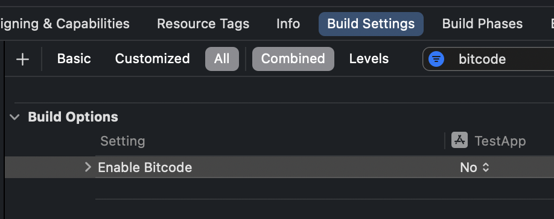

# Project Setting

1\) Xcode > Build Settings > Build Options 에서 `Enable Bitcode` 를 `No` 로 변경합니다.

* Xcode 버전에 따라 해당 설정이 없을 수 있습니다.

<figure><figcaption></figcaption></figure>

2\) Xcode > Build Settings > Linking 에서 Other Linker Flags 에 `-all-load` 또는 `-force_load` 플래그를 사용하여 빌드할 경우, 심볼 중복(Symbol Duplicate)가 발생할 수 있습니다. 이 경우 **`-ObjC`** 플래그로 변경합니다.

<figure><figcaption></figcaption></figure>

3\) Xcode > Build Settings > Search Paths 에서 Framework Search Paths 에 **`$(inherited)`** 값이 추가되어 있는지 확인하고, 추가되어 있지 않다면 관련 라이브러리를 찾을 수 없다는 빌드 에러가 발생할 수 있으므로 반드시 추가합니다.

<figure><figcaption></figcaption></figure>

4\) Xcode > Build Settings > Build Options 에서 `User Script Sandboxing` 를 `No` 로 변경합니다.

* Xcode 버전에 따라 해당 설정이 없을 수 있습니다.

<figure><figcaption></figcaption></figure>

